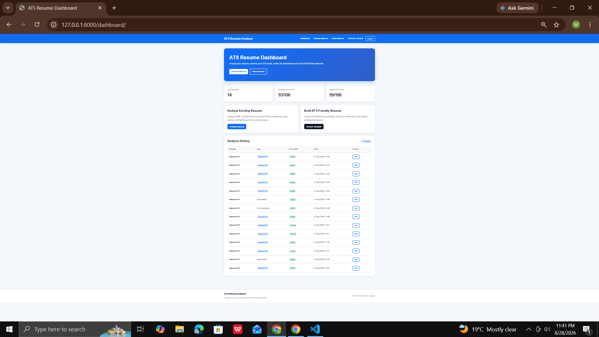

# ATS Resume Analyzer

An AI-powered web application that analyzes resumes for ATS (Applicant Tracking System) compatibility, identifies skills and resume sections, evaluates formatting, compares resumes with optional job descriptions, provides improvement recommendations, and helps users build ATS-friendly resumes.

---

## Project Overview

Many resumes are rejected or overlooked before reaching a recruiter because they are difficult for Applicant Tracking Systems (ATS) to parse or do not contain relevant keywords.

**ATS Resume Analyzer** helps users understand how well their resume is structured for ATS screening and what can be improved.

The application provides two main capabilities:

1. **Analyze an Existing Resume**
2. **Build a New ATS-Friendly Resume**

The Job Description is **optional**. Users can perform a general ATS analysis without providing a job description, or provide one for job-specific keyword matching.

---

## Key Features

### Resume Analysis

* Upload PDF or DOCX resumes
* Extract resume text automatically
* Generate an overall ATS score out of 100
* Evaluate keyword coverage
* Detect technical skills
* Detect important resume sections
* Evaluate experience signals
* Check basic resume formatting and readability
* Display extracted resume text
* Provide actionable improvement recommendations

### Job-Specific Analysis

Job Description input is optional.

When a Job Description is provided, the system can:

* Compare resume and job-description keywords
* Identify matched keywords
* Identify missing keywords
* Calculate similarity score
* Provide job-specific recommendations

When no Job Description is provided, the system performs a **General ATS Analysis**.

### Resume Dashboard

Users can view:

* Total analyses
* Average ATS score
* Latest ATS score
* Analysis history
* Resume filename
* Job title
* Analysis date
* Individual analysis details

### ATS Resume Builder

Users can create an ATS-friendly resume from scratch using multiple templates.

Available templates:

* Classic ATS
* Modern ATS
* Student / Fresher ATS
* Professional ATS
* Executive ATS
* Minimal ATS

### Resume Preview

Users can:

* Preview their completed resume
* Edit resume information
* Print the resume
* Download PDF
* Download DOCX

### User Accounts

The application includes:

* User registration
* Login
* Logout
* User-specific resume data
* User-specific analysis history
* Access control for uploaded resumes and generated resumes

---

## ATS Scoring

The application calculates the ATS score using multiple factors.

Current scoring categories include:

| Category          | Description                                    |
| ----------------- | ---------------------------------------------- |
| Keyword Score     | Evaluates keyword alignment                    |
| Skills Score      | Detects relevant technical skills              |
| Section Score     | Checks important resume sections               |
| Experience Score  | Detects experience and action-oriented signals |
| Formatting Score  | Evaluates basic text structure and readability |
| Overall ATS Score | Weighted combination of the above categories   |

The score is a **custom ATS compatibility score generated by this application**. It is not an official score from any particular Applicant Tracking System because ATS platforms use different parsing and ranking methods.

---

## Technology Stack

### Backend

* Python
* Django
* SQLite for local development
* PostgreSQL for production deployment

### Resume Processing

* PyMuPDF
* python-docx

### Resume Generation

* ReportLab
* python-docx

### Frontend

* HTML5
* CSS3
* JavaScript where required

### Deployment

* Gunicorn
* WhiteNoise
* Render
* PostgreSQL

### Development Tools

* Visual Studio Code
* Python Virtual Environment

---

## Project Structure

```text
ATS-Resume-Analyzer/
│
├── .gitignore
├── README.md
├── requirements.txt
├── build.sh
├── render.yaml
├── manage.py
│
├── ai/
│   ├── __init__.py
│   ├── analyzer.py
│   ├── keywords.py
│   ├── parser.py
│   ├── sections.py
│   └── skills.py
│
├── analyzer/
│   ├── __init__.py
│   ├── admin.py
│   ├── apps.py
│   ├── forms.py
│   ├── models.py
│   ├── urls.py
│   ├── views.py
│   ├── documents.py
│   │
│   └── migrations/
│
├── ats_analyzer/
│   ├── __init__.py
│   ├── settings.py
│   ├── urls.py
│   ├── asgi.py
│   └── wsgi.py
│
├── templates/
│   ├── base.html
│   │
│   ├── analyzer/
│   │   ├── dashboard.html
│   │   ├── upload.html
│   │   ├── result.html
│   │   ├── templates.html
│   │   ├── builder.html
│   │   └── builder_preview.html
│   │
│   └── registration/
│       ├── login.html
│       └── register.html
│
├── static/
│   └── css/
│       └── style.css
│
└── media/
```

---

## How the Application Works

### Existing Resume Analysis

```text
User Registration
        ↓
Login
        ↓
Upload PDF / DOCX
        ↓
Extract Resume Text
        ↓
Analyze Resume
        ↓
Calculate ATS Metrics
        ↓
Save Analysis
        ↓
Display Result
```

### Job-Specific Analysis

```text
Resume
   +
Job Description
        ↓
Keyword Extraction
        ↓
Keyword Comparison
        ↓
Matched Keywords
        ↓
Missing Keywords
        ↓
Similarity Analysis
        ↓
Job-Specific Recommendations
```

### Resume Builder

```text
Choose Template
        ↓
Enter Resume Information
        ↓
Save Resume
        ↓
Preview Resume
        ↓
Download PDF / DOCX
```

---

## Installation

### 1. Clone or Download the Project

Place the project on your local machine.

Example:

```text
C:\Users\Administrator\Desktop\ATS-Resume-Analyzer
```

### 2. Open the Project

```powershell
cd C:\Users\Administrator\Desktop\ATS-Resume-Analyzer
```

### 3. Create a Virtual Environment

```powershell
python -m venv venv
```

### 4. Activate the Virtual Environment

Windows PowerShell:

```powershell
.\venv\Scripts\Activate.ps1
```

Windows Command Prompt:

```cmd
venv\Scripts\activate
```

### 5. Install Dependencies

```powershell
pip install -r requirements.txt
```

If `requirements.txt` is not available, install the main packages:

```powershell
pip install django pymupdf python-docx reportlab gunicorn whitenoise dj-database-url psycopg2-binary
```

---

## Database Setup

Run migrations:

```powershell
python manage.py makemigrations
```

```powershell
python manage.py migrate
```

Create an admin user:

```powershell
python manage.py createsuperuser
```

Follow the prompts to create the administrator account.

---

## Run the Application

Run:

```powershell
python manage.py check
```

If there are no errors:

```powershell
python manage.py runserver
```

Open:

```text
http://127.0.0.1:8000/
```

---

## Main Routes

| URL                      | Purpose                |
| ------------------------ | ---------------------- |
| `/`                      | Home                   |
| `/accounts/login/`       | Login                  |
| `/accounts/register/`    | Registration           |
| `/dashboard/`            | User dashboard         |
| `/upload/`               | Resume analysis        |
| `/templates/`            | Resume templates       |
| `/builder/classic/`      | Classic template       |
| `/builder/modern/`       | Modern template        |
| `/builder/student/`      | Student template       |
| `/builder/professional/` | Professional template  |
| `/builder/executive/`    | Executive template     |
| `/builder/minimal/`      | Minimal template       |
| `/result/<id>/`          | Resume analysis result |
| `/analysis/<id>/`        | Historical analysis    |
| `/admin/`                | Django administration  |

---

## Resume Analysis Example

A typical result contains:

```text
Overall ATS Score
99/100

Keyword Score
100/100

Skills Score
100/100

Section Score
100/100

Experience Score
85/100

Formatting Score
100/100
```

The result page also provides:

* Detected skills
* Missing keywords
* Resume section status
* Improvement recommendations
* Matched keywords
* Similarity score when a Job Description is provided
* Extracted resume text

---

## Supported Resume Formats

Currently supported:

```text
PDF
DOCX
```

For best results, use a text-based PDF rather than a scanned image-only PDF.

---

## Security and User Data

The application associates resumes and analyses with the authenticated user.

This means:

```text
User A
   ↓
User A's Resumes
   ↓
User A's Analyses

User B
   ↓
User B's Resumes
   ↓
User B's Analyses
```

Views use authenticated-user ownership checks so users cannot normally access another user's resume records through the application.

Do not commit:

* Passwords
* API keys
* Secret keys
* `.env` files
* User resumes
* Local databases
* Virtual environments

---

## Environment Configuration

For production, sensitive configuration should be stored in environment variables.

Example:

```text
DJANGO_SECRET_KEY=your-secret-key
DEBUG=False
DATABASE_URL=your-database-url
```

Do not hard-code production secrets in source code.

---

## Static Files

The application uses Django static files.

Development configuration:

```python
STATIC_URL = "/static/"

STATICFILES_DIRS = [
    BASE_DIR / "static",
]
```

Production configuration should also define:

```python
STATIC_ROOT = BASE_DIR / "staticfiles"
```

WhiteNoise can be used to serve static files in production.

---

## Deployment

The project includes:

```text
build.sh
render.yaml
```

These files are intended to help deploy the application to a hosting platform such as Render.

Typical production architecture:

```text
Git Repository
       ↓
Render
       ↓
Django + Gunicorn
       ↓
PostgreSQL
       ↓
Public HTTPS URL
```

For production, use PostgreSQL rather than relying on SQLite.

Uploaded resume files should also use appropriate persistent/external storage in a production environment rather than depending on an ephemeral local filesystem.

---

## Build Script

The `build.sh` file performs tasks such as:

```bash
pip install -r requirements.txt
python manage.py collectstatic --no-input
python manage.py migrate
```

The production server runs through Gunicorn:

```bash
gunicorn ats_analyzer.wsgi:application
```

---

## Future Improvements

Possible future enhancements include:

* Machine-learning based job-fit prediction
* Resume keyword recommendations
* Advanced semantic similarity
* Resume section quality scoring
* Duplicate keyword detection
* Grammar and spelling analysis
* Resume readability scoring
* LinkedIn profile integration
* Multiple resume versions
* Resume comparison
* Analytics charts
* Cloud file storage
* Email-based authentication
* Password reset
* Recruiter dashboard
* Export to additional resume formats

---

## Challenges Faced

### Resume Text Extraction

Different resume file types have different structures.

**Solution:**
Used document/PDF extraction libraries and stored extracted text for analysis.

### Keyword Matching

Simple keyword matching can produce irrelevant words.

**Solution:**
Implemented dedicated keyword extraction and comparison logic and kept Job Description matching optional.

### ATS Scoring

A resume may have strong formatting but weak keyword coverage, or strong skills but weak experience signals.

**Solution:**
Separated the ATS score into multiple measurable categories rather than using a single rule.

### User Data Isolation

Different users should not see each other's analysis history.

**Solution:**
Associated resumes and analyses with authenticated users and applied ownership checks in views.

### Resume Generation

Generated resumes need to remain readable and machine-readable.

**Solution:**
Used simple text-based layouts for generated PDF and DOCX files.

---

## Testing

Before deployment, run:

```powershell
python manage.py check
```

For deployment configuration:

```powershell
python manage.py check --deploy
```

Also manually test:

```text
Register
    ↓
Login
    ↓
Upload Resume
    ↓
Analyze Resume
    ↓
View Result
    ↓
Analysis History
    ↓
Choose Template
    ↓
Build Resume
    ↓
Preview
    ↓
Download PDF
    ↓
Download DOCX
```

---

## Screenshots

Add screenshots of the following pages to the repository:

```text
Dashboard
Resume Upload
ATS Analysis Result
Resume Templates
Resume Builder
Resume Preview
```

Recommended folder:

```text
screenshots/
├── dashboard.png
├── upload.png
├── result.png
├── templates.png
├── builder.png
├── registration.png
├── login.png
└── preview.png
```

Then add them to this README using:

```markdown

```

---

## Author

**Kammineni Venkata Manasa**

Computer Science Engineering Student

Interests:

* Data Analytics
* Python
* SQL
* Power BI
* Machine Learning
* Web Development
* AI Applications

---

## Disclaimer

This project provides a custom resume-analysis score intended for educational, portfolio and resume-improvement purposes.

It does not represent an official score from a specific Applicant Tracking System or guarantee selection for a job.

Users should only add skills, keywords, achievements and experience that truthfully represent their background.

---

## License

This project is intended for educational and portfolio use.

You may add a formal open-source license such as MIT License if you plan to distribute the project publicly.

```
```
